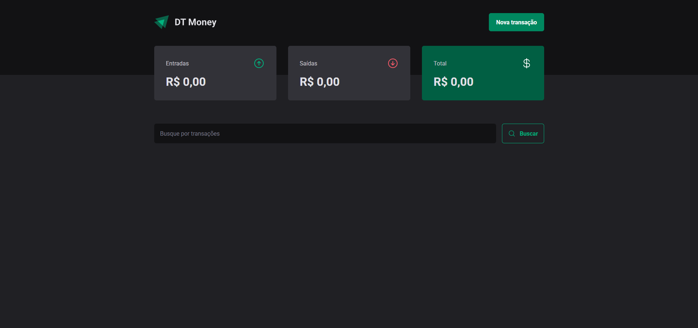

# DT Money

DT Money project created during studies.



## About

This project provides:

1. Register and list financial transactions (income and outcome).
2. Search transactions by description.
3. Summary of incomes, outcomes, and total.
4. Modal to add a new transaction.
5. Data persistence simulated via fake API (json-server).
6. Formatting of values and dates in pt-BR.
7. Componentization and use of global context for transactions.

Focus on simple and easy-to-read code.


## Tech Stack

- React
- Vite
- TypeScript
- styled-components
- react-hook-form
- zod
- Radix UI (Dialog, Radio Group)
- use-context-selector
- phosphor-react
- axios
- json-server

## Design

- [Figma](https://www.figma.com/design/sbAS11YJUaB4JmAWKA3eqa/DT-Money--Community-?m=auto&t=4n2Xz40TjoMdiJXN-6)

## How to run

```bash
# Clone this repository
git clone https://github.com/sillasemanoel/study-dt-money.git

# Enter the project folder
cd study-dt-money

# Install dependencies
npm install

# Start fake API (json-server)
npm run dev:server

# In another terminal, start the web app
npm run dev
```

## Author

Sillas Emanoel
